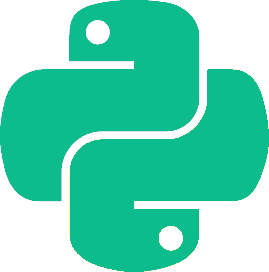

<p align="center">
  
</p>

## بلتون

یک کتابخانه برای ساختن بات در پیامرسان [بله](https://www.bale.ai/)

## نمونه ساده

```python
from balethon import Client

bot = Client("TOKEN")


@bot.on_message()
async def greet(client, message):
    await message.reply("Hello")


bot.run()
```

> باید توکن را با توکنی که بات فادر در پیامرسان [بله](https://www.bale.ai/) به شما میدهد عوض کنید

## امکانات کلیدی


- **آسان**: کار سنگین را انجام میدهد و به کار حداقلی توسط کاربر نیاز دارد
- **سریع**: بهینه و ناهمزمان
- **دارای مستندات**: بلتون را با کمک مستندات عمیق یاد بگیرید
- **کامیونیتی**: انجمن فعال و دوستانه، حتما پاسخ سؤال های خود را دریافت میکنید
- **معماری**: پشتیبانی از معماری های تابع گرا علاوه بر شیء گرا
- **قدرتمند**: وب سرویس پیامرسان بله را پوشش میدهد و ابزارهای مفیدی برای ساده‌سازی کار شما دارد
- **انعطاف‌پذیر**: غیرقابل منسوخ شدن و آماده برای پاسخ های غیرمنتظره از سمت وب سرویس پیامرسان بله
- **شهودی**: تایپ هینت شده و دارای پشتیبانی عالی از ادیتورها


## نصب کردن

```bash
pip install Balethon
```

## لینک ها

- [صفحه گیتهاب](https://github.com/SajjadAlipour2006/Balethon)
- [صفحه پایپی](https://pypi.org/project/Balethon)
- [کانال اخبار در بله](https://ble.ir/balethon)
- [گروه چت در بله](https://ble.ir/join/MTlhN2Q2Mz)

## فهرست

* [نمونه ها](./examples)

  * [بات اکو](./examples/echo_bot)
  * [بات خوش آمد گویی](./examples/welcome_bot)
  * [کامندها](./examples/commands)
  * [بات گفتگو](./examples/conversation)
  * [اینلاین کیبوردها](./examples/inline_keyboards)
  * [بات دانلودر](./examples/downloader_bot)
  * [پرداخت ها](./examples/payment_bot)

* [client](./client/)

  * [attachments](./client/attachments/)
     * [get_file](./client/attachments/get_file)
     * [send_animation](./client/attachments/send_animation)
     * [send_audio](./client/attachments/send_audio)
     * [send_contact](./client/attachments/send_contact)
     * [send_document](./client/attachments/send_document)
     * [send_location](./client/attachments/send_location)
     * [send_media_group](./client/attachments/send_media_group)
     * [send_photo](./client/attachments/send_photo)
     * [send_video](./client/attachments/send_video)
     * [send_voice](./client/attachments/send_voice)

  * [chats](./client/chats/)
     *  [ban_chat_member](./client/chats/ban_chat_member)
     *  [get_chat](./client/chats/get_chat)
     *  [get_chat_administrators](./client/chats/get_chat_administrators)
     *  [get_chat_member](./client/chats/get_chat_member)
     *  [get_chat_members_count](./client/chats/get_chat_members_count)
     *  [invite_user](./client/chats/invite_user)
     *  [leave_chat](./client/chats/leave_chat)
     *  [promote_chat_member](./client/chats/promote_chat_member)

  * [messages](./client/messages/)
     *  [delete_message](./client/messages/delete_message)
     *  [edit_message_text](./client/messages/edit_message_text)
     *  [forward_message](./client/messages/forward_message)
     *  [send_message](./client/messages/send_message)

  * [payments](./client/payments/)
     * [send_invoice](./client/payments/send_invoice)

  * [updates](./client/updates/)
     * [delete_webhook](./client/updates/delete_webhook)
     * [get_updates](./client/updates/get_updates)
     * [set_webhook](./client/updates/set_webhook)

  * [users](./client/users/)
     * [get_me](./client/users/get_me)

  * [stickers](./client/stickers/)
     * [get_sticker_set](./client/stickers/get_sticker_set)

* [event_handlers](./event_handlers)

  * [EventHandler](./event_handlers/EventHandler)
  * [ConnectHandler](./event_handlers/ConnectHandler)
  * [UpdateHandler](./event_handlers/UpdateHandler)
  * [MessageHandler](./event_handlers/MessageHandler)
  * [CallbackQueryHandler](./event_handlers/CallbackQueryHandler)
  * [PreCheckoutQueryHandler](./event_handlers/PreCheckoutQueryHandler)
  * [ShippingQueryHandler](./event_handlers/ShippingQueryHandler)
  * [CommandHandler](./event_handlers/CommandHandler)
  * [ErrorHandler](./event_handlers/ErrorHandler)
  * [DisconnectHandler](./event_handlers/DisconnectHandler)

* [objects](./objects)

  * [Message](./objects/Message)
  * [CallbackQuery](./objects/CallbackQuery)
  * [User](./objects/User)
  * [Chat](./objects/Chat)
  * [ChatMember](./objects/ChatMember)
  * [File](./objects/File)
  * [Audio](./objects/Audio)
  * [Location](./objects/Location)
  * [Photo](./objects/Photo)
  * [Voice](./objects/Voice)
  * [Invoice](./objects/Invoice)

* [conditions](./conditions)

  * [Condition](./conditions/Condition)
  * [all](./conditions/all_condition)
  * [caption](./conditions/caption_condition)
  * [contact](./conditions/contact_condition)
  * [document](./conditions/document_condition)
  * [entities](./conditions/entities_condition)
  * [forward](./conditions/forward_condition)
  * [invoice](./conditions/invoice_condition)
  * [location](./conditions/location_condition)
  * [media](./conditions/media_condition)
  * [photo](./conditions/photo_condition)
  * [private](./conditions/private_condition)
  * [reply](./conditions/reply_condition)
  * [text](./conditions/text_condition)
  * [video](./conditions/video_condition)
  * [voice](./conditions/voice_condition)
  * [channel_chat_created](./conditions/channel_chat_created_condition)
  * [delete_chat_photo](./conditions/delete_chat_photo_condition)
  * [group_chat_created](./conditions/group_chat_created_condition)
  * [left_chat_member](./conditions/left_chat_member_condition)
  * [new_chat_members](./conditions/new_chat_members_condition)
  * [new_chat_photo](./conditions/new_chat_photo_condition)
  * [new_chat_title](./conditions/new_chat_title_condition)
  * [pinned_message](./conditions/pinned_message_condition)
  * [supergroup_chat_created](./conditions/supergroup_chat_created_condition)

* [states](./states)
  * [State](./states/state)
  * [StateGroup](./states/state_group)
  * [StateMachine](./states/state_machine)

* [errors](./errors)

  * [dispatching_errors](./errors/dispatching_errors)
    * [break_dispatching](./errors/dispatching_errors/break_dispatching)
    * [continue_dispatching](./errors/dispatching_errors/continue_dispatching)
  * [rpc_errors](./errors/rpc_errors)
    * [RPCError](./errors/rpc_errors/RPCError)
    * [BadRequestError](./errors/rpc_errors/BadRequestError)
    * [ForbiddenError](./errors/rpc_errors/ForbiddenError)
    * [InternalError](./errors/rpc_errors/InternalError)
    * [NotFoundError](./errors/rpc_errors/NotFoundError)
    * [UnauthorizedError](./errors/rpc_errors/UnauthorizedError)

* [مقاله ها](./articles)
  * [بلتون دو منظوره است](./articles/balethon_is_dual_purpose)
  * [مدیریت گفتگو با کاربران](./articles/managing_conversations)
  * [بلتون سریع است](./articles/balethon_is_fast)
  * [بلتون برای پاسخ های غیر منتظره از سرور بله آمادگی دارد](./articles/balethon_is_prepared)
  * [تبدیل بلتون به کتابخانه تلگرام](./articles/balethon_for_telegram)

* [حمایت از ما](./support_us)
